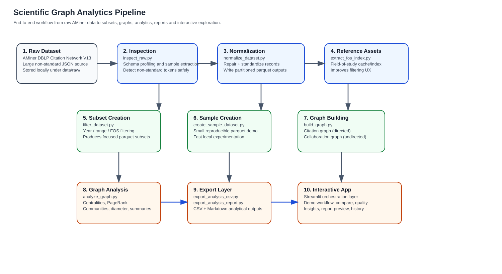
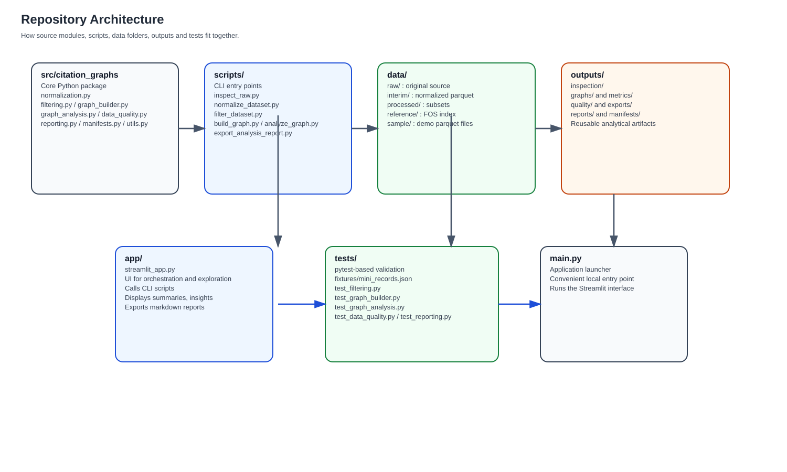
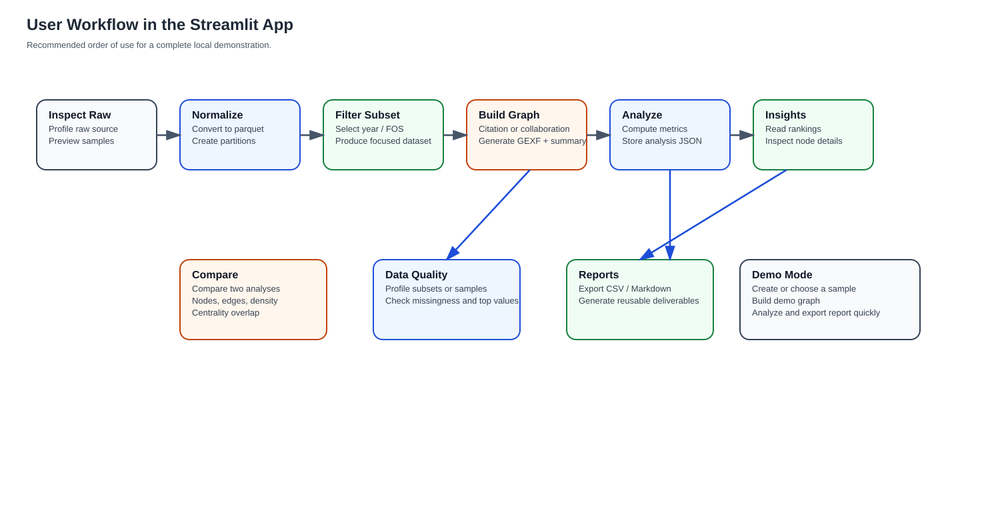

# Citation and Collaboration Graph Analysis in Science

A data engineering and graph analytics project designed to transform large-scale academic metadata into usable citation and collaboration networks, then analyze them through reproducible pipelines, interactive exploration, and exportable reports.

This project is built around the **AMiner DBLP Citation Network Dataset (V13, released on 2021-05-14)** and focuses on a complete workflow: raw data inspection, normalization, subset extraction, graph construction, network analysis, reporting, and lightweight interactive exploration through Streamlit.

---

## Project Overview

Scientific knowledge is structured as a network.

Publications cite previous work, authors collaborate across papers, and disciplines form interconnected communities. Working with this type of data at scale requires more than basic scripting: it requires a clean data pipeline, graph-aware modeling choices, scalable intermediate formats, and practical analysis outputs.

This project was developed to address that problem with a structured workflow that:

1. inspects and profiles the raw dataset,
2. normalizes non-standard JSON into partitioned parquet,
3. creates focused subsets by year, year range, and field of study,
4. builds citation and collaboration graphs,
5. computes graph metrics and communities,
6. exports reusable outputs such as GEXF, JSON, CSV, and Markdown reports,
7. provides an interactive Streamlit interface for end-to-end experimentation.

The repository is intended both as a graph analytics project and as a demonstration of practical data engineering and analytical software design.

---

## Main Objectives

The project aims to:

- convert a large raw academic dataset into graph-ready structured data,
- avoid unsafe file-splitting strategies on very large JSON sources,
- build citation and collaboration graphs from filtered scientific subsets,
- analyze graph topology and influential nodes,
- support iterative subset experimentation without reprocessing the entire dataset each time,
- export outputs for visualization and downstream use,
- provide a reproducible local workflow for scientific network exploration.

---

## Dataset

This project uses the **AMiner DBLP Citation Network Dataset**.

**Source**
- AMiner Open Data: `https://www.aminer.org/open/article?id=655db2202ab17a072284bc0c`

**Dataset version used**
- **DBLP-Citation-network V13**
- **Release date: 2021-05-14**

The dataset contains large-scale academic publication metadata and citation relationships extracted from sources such as **DBLP**, **ACM**, **MAG (Microsoft Academic Graph)**, and related academic metadata ecosystems.

Typical fields used in this project include:

- publication identifiers
- paper titles
- author identifiers and names
- publication year
- fields of study (`fos`)
- references / citation links
- venue metadata
- citation counts

Because the raw dataset is very large, it is **not versioned in GitHub**. The repository ships the pipeline and tools, not the raw source dump.

---

## Engineering Approach

A key design choice in this project is to avoid brittle handling of the raw source file.

Instead of splitting the original dataset by byte size, which can corrupt records in large JSON-like sources, the project now relies on a safer streaming-oriented approach:

- raw inspection first,
- controlled normalization,
- partitioned parquet output,
- subset-first graph experimentation.

This makes the workflow significantly more robust and better suited to large datasets.

---

## Pipeline

The current workflow follows this sequence.

### 1. Raw inspection
The raw source file is inspected before transformation.

This stage is used to:
- detect non-standard JSON patterns such as `NumberInt(...)`,
- inspect sample records,
- understand schema variability,
- profile the dataset without modifying it.

### 2. Normalization
The raw dataset is converted into a normalized parquet representation.

This stage:
- repairs non-standard raw JSON patterns,
- standardizes key fields,
- computes clean derived columns such as `year_clean`,
- partitions the normalized dataset for downstream filtering.

### 3. Subset creation
Focused subsets are created from the normalized parquet data.

Available filtering strategies include:
- exact year,
- year range,
- field of study,
- year + field of study combinations.

This makes experimentation faster and more manageable than rebuilding graphs from the entire normalized dataset.

### 4. Graph construction
Two graph families can be built.

**Citation graph**
- directed
- publications as nodes
- references as edges

**Collaboration graph**
- undirected
- authors as nodes
- co-authorship links as edges

### 5. Graph analysis
The analysis layer computes reusable graph metrics such as:

- number of nodes and edges
- density
- largest connected component statistics
- diameter (exact or approximate depending on graph size)
- clustering
- degree centrality
- closeness centrality
- betweenness centrality
- PageRank
- Louvain community detection

### 6. Reporting and export
The project can export:

- graph files (`.gexf`)
- analysis JSON files
- CSV metric exports
- Markdown analytical reports

These outputs can be reused in:
- Streamlit
- Gephi
- notebooks
- documentation
- portfolio demonstrations

### 7. Interactive exploration
A Streamlit app provides a lightweight interface for:

- raw inspection
- normalization
- subset creation
- graph building
- graph analysis
- insight exploration
- comparison of analysis outputs
- data quality reporting
- Markdown report generation

---

## Features

### Data engineering
- raw dataset inspection
- non-standard JSON normalization
- partitioned parquet generation
- subset-oriented workflow for scalable experimentation

### Graph analytics
- citation graph construction
- collaboration graph construction
- centrality analysis
- PageRank
- community detection
- largest-component analysis

### Product layer
- Streamlit app for local experimentation
- graph comparison dashboard
- data quality dashboard
- run history tracking
- Markdown analytical report export

### Quality and reliability
- modular Python package structure
- CLI-first scripts
- automated tests for core modules
- sample fixtures for validation

---

## Repository Structure

```text
.
├── app/
│   └── streamlit_app.py
├── data/
│   ├── raw/
│   ├── interim/
│   ├── processed/
│   ├── reference/
│   └── sample/
├── docs/
│   └── diagrams/
│       ├── pipeline_overview.svg
│       ├── repository_architecture.svg
│       └── streamlit_user_workflow.svg
├── outputs/
│   ├── figures/
│   ├── graphs/
│   ├── inspection/
│   ├── manifests/
│   ├── metrics/
│   ├── quality/
│   ├── reports/
│   └── exports/
├── scripts/
│   ├── inspect_raw.py
│   ├── normalize_dataset.py
│   ├── filter_dataset.py
│   ├── build_graph.py
│   ├── analyze_graph.py
│   ├── export_analysis_csv.py
│   ├── export_analysis_report.py
│   ├── extract_fos_index.py
│   ├── create_sample_dataset.py
│   ├── repair_gexf.py
│   └── search_dataset.py
├── src/
│   └── citation_graphs/
│       ├── __init__.py
│       ├── data_quality.py
│       ├── exceptions.py
│       ├── export.py
│       ├── filtering.py
│       ├── fos_index.py
│       ├── graph_analysis.py
│       ├── graph_builder.py
│       ├── graph_cleaning.py
│       ├── io.py
│       ├── manifests.py
│       ├── normalization.py
│       ├── raw_inspection.py
│       ├── reporting.py
│       ├── search.py
│       └── utils.py
├── tests/
│   ├── fixtures/
│   │   └── mini_records.json
│   ├── conftest.py
│   ├── test_data_quality.py
│   ├── test_filtering.py
│   ├── test_graph_analysis.py
│   ├── test_graph_builder.py
│   └── test_reporting.py
├── .gitignore
├── LICENSE
├── main.py
├── pyproject.toml
├── README.md
└── requirements.txt

```

---

## Project Diagrams

The repository includes three project diagrams under `docs/diagrams/` to document the workflow and architecture:

- **Pipeline overview**: `docs/diagrams/pipeline_overview.svg`
- **Repository architecture**: `docs/diagrams/repository_architecture.svg`
- **Streamlit user workflow**: `docs/diagrams/streamlit_user_workflow.svg`

### Pipeline Overview



### Repository Architecture



### Streamlit User Workflow


## Installation

Clone the repository:
```bash
git clone https://github.com/kenzi0228/Data-engineering-citations-and-collaborations-in-science.git
cd Data-engineering-citations-and-collaborations-in-science
```

Create a virtual environment:
```bash
python -m venv .venv
```

Activate it:

Windows
```bash
.venv\Scripts\activate
```
macOS / Linux
```bash
source .venv/bin/activate
```
Install dependencies:
```bash 
pip install -r requirements.txt
```
## Quick Start

### 1. Launch the application

The Streamlit interface is the easiest way to explore the workflow locally.

### 2. Recommended workflow

Use the app in this order:

1. Inspect Raw
2. Normalize
3. Filter Subset
4. Build Graph
5. Analyze Graph
6. Explore Insights / Compare / Data Quality
7. Export Markdown Report

---

## CLI Usage

### Inspect the raw dataset

```bash
python scripts/inspect_raw.py --input data/raw/dblpv13.json --max-records 3
```

### Normalize the dataset
```bash
python scripts/normalize_dataset.py --input data/raw/dblpv13.json --output data/interim/normalized --batch-size 10000 --min-year 1800 --max-year 2026
```

### Create a subset for year 2020
```bash
python scripts/filter_dataset.py --input data/interim/normalized --output data/processed/subsets --mode year --year 2020 --subset-name year_2020
```

### Build a citation graph
```bash
python scripts/build_graph.py --input data/processed/subsets/year_2020/data.parquet --output outputs/graphs --graph-type citation --graph-name year_2020 --limit 5000
```

### Analyze the graph
```bash
python scripts/analyze_graph.py --input outputs/graphs/year_2020_citation.gexf --output outputs/metrics/year_2020_citation_analysis.json --top-n 10 --betweenness-sample-k 200
```

### Export a Markdown report
```bash
python scripts/export_analysis_report.py --input outputs/metrics/year_2020_citation_analysis.json --output outputs/reports/year_2020_citation_report.md --name year_2020_citation
```


## Sample / Demo Workflow

The repository supports lightweight demo usage through small local samples.

This allows you to:

- create a reduced parquet sample from an existing subset,
- build a graph from that sample,
- analyze it,
- export a report,
- demonstrate the project quickly without re-running the full pipeline.

This is particularly useful for:

- portfolio demos,
- quick recruiter walkthroughs,
- local testing,
- iterative debugging.

---

## Outputs

Depending on the executed workflow, the project can generate the following outputs.

### Inspection

- `outputs/inspection/raw_profile.json`
- `outputs/inspection/raw_samples.json`

### Normalization

- partitioned parquet under `data/interim/normalized/`
- normalization summary JSON

### Subsets

- subset parquet files under `data/processed/subsets/...`
- subset summaries

### Graphs

- GEXF graph exports under `outputs/graphs/`
- graph build summaries

### Analytics

- analysis JSON under `outputs/metrics/`
- CSV exports under `outputs/exports/`
- Markdown reports under `outputs/reports/`

### Tracking

- pipeline run manifests under `outputs/manifests/`

---

## Testing

The repository includes automated tests covering core project modules.

Current tested areas include:

- filtering logic
- graph building
- graph analysis
- data quality reporting
- Markdown reporting

This test layer improves confidence in the project’s core behavior and helps stabilize future iterations.

---

## Tech Stack

- Python
- DuckDB
- NetworkX
- Pandas
- Streamlit
- python-louvain
- PyArrow / parquet tooling
- pytest
- Gephi for external graph exploration

---

## Key Engineering Decisions

### Streaming-oriented raw handling

The project avoids naive byte-based splitting of the raw dataset and instead uses a safer normalization workflow.

### Parquet as intermediate storage

Normalized parquet subsets make repeated filtering and graph experimentation far more practical than operating repeatedly on the raw source file.

### Subset-first graph analysis

Graph building is performed on focused subsets rather than blindly on the entire dataset, making experimentation more controllable and more realistic on local machines.

### Separation between pipeline and interface

Core logic lives in modular Python modules and CLI scripts, while Streamlit acts as an orchestration and exploration layer.

### Reusable analytical artifacts

JSON, CSV, GEXF, and Markdown outputs make the project useful both interactively and as a portfolio artifact.

---

## What This Project Demonstrates

This repository showcases practical skills in:

- large-scale semi-structured data handling
- robust preprocessing and normalization design
- graph-based data modeling
- citation network construction
- collaboration network construction
- graph analytics and community detection
- local analytical tooling design
- modular Python engineering
- CLI + Streamlit workflow integration
- automated testing of analytical components

---

## Current Limitations

Some limitations still remain:

- the raw AMiner dataset is not bundled due to its size
- very large graph subsets can still be expensive to analyze locally
- some textual encoding artifacts may come from the original data source
- the project is local-first and not designed as a distributed production system
- graph visualization is export-oriented rather than fully interactive in-browser

---

## Future Improvements

Possible next steps include:

- final README screenshots and diagrams
- richer graph visual previews
- text cleaning for problematic source encodings
- stronger end-to-end pipeline validation
- centralized configuration file support
- logging standardization across all scripts
- performance tuning for larger subsets

---

## License

This project is distributed under the MIT License.

---

## Author

**Kenzi Mohamed LALI**  
GitHub: `kenzi0228`